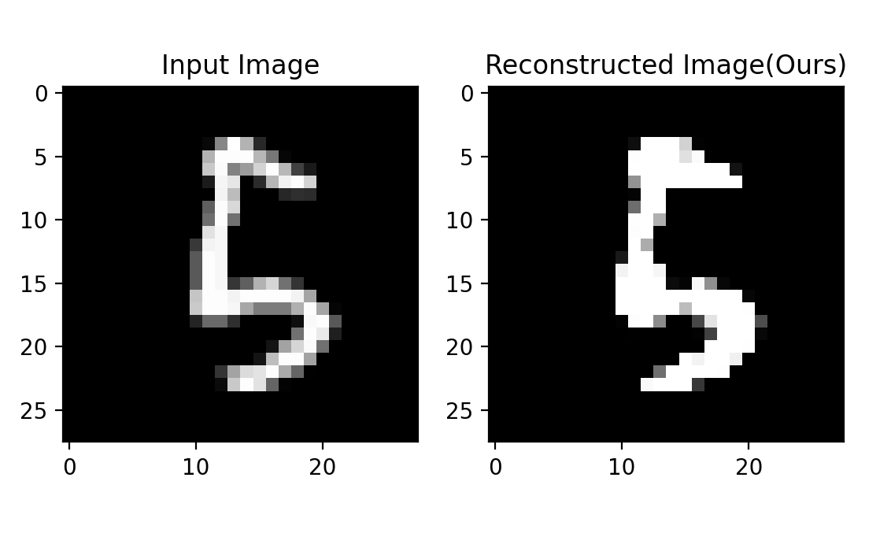
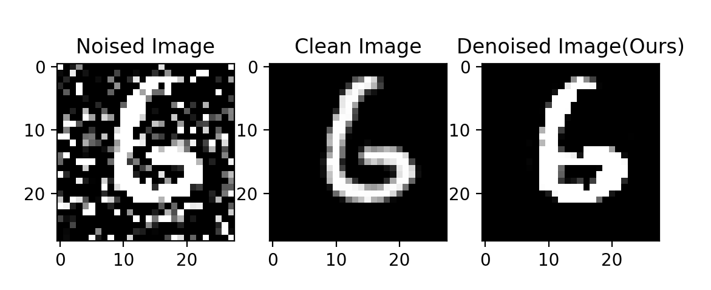

# Denoising Images Using AutoEncoders in Pytorch

In this repository is a demo project that attempts to denoise an image. For the sake of training time, we used manual noised images from the MNIST dataset, but the project could be scaled to use larger sets such as CIFAR-10 for RGB images.

The program is trained in two steps.

## Structure of the program
```cmd
./
    main.py - training script
    Model.py - the architecture of the autoencoder
    DataSets.py - the script which generate the MNIST dataset
    test.py - a testing script
    model_denoising.pth - parameters of the trained denoising model(model at the first step, see below)
    model_reconstruction.pth - parameters of the final model(model at the 2nd step, see below) 

```

## First step

In the first step, the model is trained to reconstruct the clean images. An example is shown below.



## Second Step

To denoise more accuratly, we decided that for the secound training step, we should freez the decoder parameters and allow only for the encoder to be trained. This shortens the training time and predicts more accuratly the denoised image because it only has to learn the encoded sequence for the already trained decoded clean images. The result is shown in the figure below



## Thoughts

After the training is complete, in the cmd it should print(it outdetects overfitting):

```cmd
Loss for the epoch 99 is 0.48722025470733643: 100%|███████████| 100/100 [41:25<00:00, 24.86s/it]
Loss for the epoch 87 is 0.5106367990175883:   88%|█████████  | 88/100 [42:27<05:48, 29.00s/it]
Training loss has not decreased in the last 6 epochs. Stopping training.
```

Is important to notice that the noised image(the example shown above) has never been seen by the network and is the only input received.
